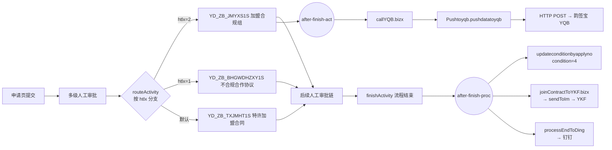

# 网点加盟合同签批申请流程 BRD/PRD（逆向工程）

> 代码来源：`danieleiand/testOldSoa`（Java 100%）
>
> 本文档根据 EOS/ABFrame 导出的 PageFlow（.flowx）、Workflow（.workflowx）与 BusinessLogic（.bizx）以及 Java Bizlet 代码进行逆向梳理，目标是形成可指导后续开发与可对业务方说明的 BRD/PRD。
>
> 版本：V1.0（初稿）
> 日期：2026-03-25

---

## 0. 文档信息

- 流程 ID：`com.yd.soa.bpsyewumgr.kdwdjoincontract.kdwdjoincontract`
- 流程名称：快递网点加盟合同签批流程
- 申请页 PageFlow：`com.yd.soa.bpsyewumgr.kdwdjoincontract.kdwdjoincontract_apply`
  - 填制页 JSP：`/bpsyewu/kdwdjoincontract/ydywcontract_input.jsp`
  - 查看页 JSP：`/bpsyewu/kdwdjoincontract/ydywcontract_view.jsp`
  - 审批提交页流：`com.yd.soa.bpsyewumgr.kdwdjoincontract.kdwdjoincontract_approve.flow`
- 审批页 PageFlow：`com.yd.soa.bpsyewumgr.kdwdjoincontract.kdwdjoincontract_approve`
  - ��用审批 JSP：`/comm/common/jsp/commChecked.jsp`
- 关键源码（本 PRD 引用）：
  - `kdwdjoin/.../kdwdjoincontract/Pushtoyqb.java`
  - `kdwdjoin/.../kdwdjoincontract/kdwdjoincontract/callYQB.bizx`
  - `kdwdjoin/.../kdwdjoincontract/kdwdjoincontract/joinContractToYKF.bizx`
  - `kdwdjoin/.../kdwdjoincontract/kdwdjoincontract.workflowx`

---

## 1. 背景与目标

### 1.1 背景
“网点加盟合同签批申请”属于传统 OA/流程类业务，前端由 ABFrame PageFlow+JSP 承载，流程引擎由 WorkflowX 定义，关键集成/数据准备由 BizX 与 Java Bizlet 实现。

### 1.2 目标
1. 还原端到端业务流程（含分支条件）。
2. 梳理页面动作（init/save/detail）与后端逻辑映射。
3. 梳理所有内部/外部接口（YQB、YKF、钉钉等），明确入参/出参与触发场景。
4. 输出可指导后续开发、测试、以及面向业务方说明的规格说明。

---

## 2. 范围（Scope）

### 2.1 覆盖范围
- 申请：发起网点加盟合同签批流程。
- 审批：多级人工节点审批与路由。
- 外部集成：
  - 韵签宝（YQB）签字盖章推送
  - YKF（通过 IM 通道推送合同关键资料）
  - 钉钉：流程结束通知推送

### 2.2 不在范围（待补齐）
- 全量页面字段/控件与前端校��（需补齐 JSP/页面脚本/页面控件配置）。
- 完整 DB 物理表结构与字段字典（需补齐实体定义/建表脚本）。
- `LizhiToIm.sendToIm`、`pushDingTalk.processEndToDing` 的协议细节与返回码规范（需查看对应实现）。

---

## 3. 角色与权限（高层）

> 参与者由 `com.yd.soa.bpsclient.wf.WfParticipantsTools.getParticipants` 按规则生成，workflowx 中配置的规则包含 `G_ROLE`、`Z_A_P` 等。

典型人工节点（按 workflow 片段整理，名称以 activityId 为准）：
- `YD_SGSWDGLBFZR`：省公司网点管理部负责人
- `YD_DQ_ZFZR`：省总
- `routeActivity`：按合同类型路由
- `YD_ZB_JMYXS1S`：加盟合规组（分支之一：加盟意向书）
- `YD_ZB_TXJMHT1S`：特许加盟合同（分支之一）
- `YD_ZB_BHGWDHZXY1S`：不合规网点合作协议（分支之一）
- `WDFZR`：网点负责人
- `YD_ZB_JMHGZFZR`：加盟合规组负责人（后续链路节点名需结合完整 workflowx 校验）
- `CSGLBSH`：城市管理部审核
- `ZBFWBSH`：总部法务部审核
- `ZBMSCSH`：总部秘书处审核
- `XGSQR`：修改申请人
- `ZBMSC`：总部秘书处

---

## 4. 业务流程（端到端）

### 4.1 主流程概述
1. 申请人进入申请页填写并提交。
2. 流程���入多级人工审批。
3. 在 `routeActivity` 根据合同类型 `htlx` 分支：
   - `htlx = 2` → `YD_ZB_JMYXS1S`（加盟意向书）
   - `htlx = 1` → `YD_ZB_BHGWDHZXY1S`（不合规网点合作协议）
   - 默认 → `YD_ZB_TXJMHT1S`（特许加盟合同）
4. 审批流转至最终节点 `finishActivity`。
5. 流程结束后触发若干系统动作（状态更新、YKF 推送、钉钉推送）。

### 4.2 自动触发点（必须落流程图）

#### 4.2.1 节点完成后触发：韵签宝（YQB）
- 触发位置：活动 `YD_ZB_JMYXS1S`（加盟合规组）
- 触发事件：`after-finish-act`
- 触发 action：`com.yd.soa.bpsyewumgr.kdwdjoincontract.kdwdjoincontract.callYQB`
- 入参：
  - `processinstid = thisProcessInst/processInstID`
  - `activityInstID = thisActivityInst/activityInstID`
  - `activityDefID = "WDFZR"`（常量；需核对业务含义：用于传给 YQB 的节点标识）

#### 4.2.2 流程结束后触发（after-finish-proc）：三项动作
1) 更新申请单状态
- action：`com.yd.soa.bpsclient.comm.updateState.updateconditionbyapplyno`
- 参数：`condition = 4`；`applyno = auditComm/applyNo`

2) 推送 YKF（IM 通道）
- action：`com.yd.soa.bpsyewumgr.kdwdjoincontract.kdwdjoincontract.joinContractToYKF`
- 参数：`processinstid = thisProcessInst/processInstID`
- exceptionStrategy：ignore（推送失败不影响流程办结）

3) 推送钉钉
- action：`com.yd.soa.intf.message.pushDingTalk.processEndToDing`
- 参数：`thisProcessInst = thisProcessInst`

---

## 5. 页面与交互（页面业务操作清单）

### 5.1 申请页（填制页）
- PageFlow：`kdwdjoincontract_apply.flowx`
- JSP：`/bpsyewu/kdwdjoincontract/ydywcontract_input.jsp`
- 查看 JSP：`/bpsyewu/kdwdjoincontract/ydywcontract_view.jsp`
- 典型页面动作（来自 PageFlow）：
  - `init`：页面初始化
  - `save`：保存/提交
  - `detail`：查看详情

> 待补齐：字段清单、必填校验、附件、股权子表编辑交互。

### 5.2 审批页
- PageFlow：`kdwdjoincontract_approve.flowx`
- JSP：`/comm/common/jsp/commChecked.jsp`
- 典型动作：默认审批链（defaultline）与 detail 查看链。
- 备注：approve.flowx 的 detail 分支中存在 `yqbfileList` 相关变量准备，推断审批详情可能展示韵签宝文件/签署信息（需结合页面与后端实现确认）。

---

## 6. 前后端交互映射（关键动作 → 后端逻辑 → 调用链）

### 6.1 动作：节点完成后触发韵签宝（YQB）
**触发**：workflow `YD_ZB_JMYXS1S.after-finish-act`

**Action**：`com.yd.soa.bpsyewumgr.kdwdjoincontract.kdwdjoincontract.callYQB`

**BizLogic**：`callYQB.bizx`（核心逻辑：准备数据 → 调用 Java 推送）

**最终 Java 调用**：
- `com.yd.soa.bpsyewumgr.kdwdjoincontract.Pushtoyqb.pushdatatoyqb(processInfo, processDetail, activityInstID, activityDefID)`

**callYQB.bizx 数据准备要点（逆向）**：
- 按 `processinstid` 查询合同主表：`DatabaseUtil.queryEntitiesByTemplate` → `ydYwKdwdjoincontracts[1]`
- 按网点编码查询组织附加信息（派送范围）：`OmOrgnizationAppend` + `DatabaseUtil.expandLobProperty(wpsfw, wnpsfw)`
  - 回填：`psfw = wpsfw`，`npsfw = wnpsfw`
  - 若 lob 为空则用 `"-"` 占位（当前实现）
- 在特定条件（`activityDefID == ZBMSC`）下，通过 `OA_APPROVALINFO` 查询并回填：
  - `mscapprovedate`、`fwbapprovedate`

### 6.2 动作：流程结束后推送 YKF
**触发**：workflow `after-finish-proc`

**Action**：`com.yd.soa.bpsyewumgr.kdwdjoincontract.kdwdjoincontract.joinContractToYKF`

**BizLogic**：`joinContractToYKF.bizx`

**调用链（逆向）**：
1. `DatabaseUtil.expandEntityByTemplate(default, contract, contract)`：按 `processinstid` 扩展查询合同主表
2. 组装 map → `fastjson` 转 `json`：
   - `wdcode → comCode`
   - `fzrname → principalPersonName`
   - `fzrmobile → principalPersonPhone`
   - `frname → legalPersonName`
   - `frmobile → legalPersonPhone`
   - `yyzzname → registeredCompanyName`
3. `BusinessDictUtil.getDictName("YD_KD_WDJOINCONTOYFK","url")` 读取推送 URL
4. `com.yd.soa.bpspersonel.lizhi_version_two.LizhiToIm.sendToIm(url, json)` 推送，得到 `result`

### 6.3 动作：流程结束后推送钉钉
**触发**：workflow `after-finish-proc`

**Action**：`com.yd.soa.intf.message.pushDingTalk.processEndToDing`

> 待补齐：消息模板、收件人规则、失败策略（需查看实现）。

---

## 7. 接口调用清单（内部/外部）

### 7.1 外部接口：韵签宝（YQB）签字盖章推送
- 触发场景：`YD_ZB_JMYXS1S` 节点完成后自动触发
- URL 配置：业务字典 `PUSHWDJOINHTTOYQB/url`
- 请求方式：HTTP POST（`HttpClientExt.callHttpWithPost2`）
- 请求体：JSON（由 `Pushtoyqb.pushdatatoyqb` 组装）
- 数据来源：
  - `processInfo`：合同主表（含派送范围、审批日期等）
  - `processDetail`：股权明细 `ydYwKdwdjoincontractWdgqxxs`（数组）
- 响应：解析返回 JSON 并取 `code/message`
  - `retData[0] = code`
  - `retData[1] = message`

### 7.2 外部接口：YKF 推送（IM 通道）
- 触发场景：流程结束后自动触发
- URL 配置：业务字典 `YD_KD_WDJOINCONTOYFK/url`
- 请求体字段口径（来自 joinContractToYKF.bizx）：
  - `comCode`
  - `principalPersonName`
  - `principalPersonPhone`
  - `legalPersonName`
  - `legalPersonPhone`
  - `registeredCompanyName`
- 响应：`result:String`

### 7.3 外部接口：钉钉
- 触发场景：流程结束后自动触发
- action：`pushDingTalk.processEndToDing`

### 7.4 内部通用能力
- 业务字典：`BusinessDictUtil.getDictName(dictTypeId, dictId)`
- 数据库：
  - `DatabaseUtil.queryEntitiesByTemplate`
  - `DatabaseUtil.expandEntityByTemplate`
  - `DatabaseUtil.expandLobProperty`
  - `DatabaseUtil.queryEntitiesByCriteriaEntity`

---

## 8. 数据模型（实体关系/核心字段）

### 8.1 核心主实体：`YdYwKdwdjoincontract`
用于：流程主数据、对外推送（YQB/YKF）

关键字段（从 `Pushtoyqb.java` 与 bizx 映射可见，非穷举）：
- 流程：`processinstid`、`appdate`、`applyuserid`、`applyusername`、`htlx`
- 网点：`wdcode`、`wdname`
- 负责人：`fzrname`、`fzrmobile`、`fzrsfzno`、`fzrsfzaddress`
- 法人：`frname`、`frmobile`、`frsfzno`、`frsfzaddress`
- 证照：`yyzzname`、`tyshxycode`、`yyzzdatefrom/to`、`kdywjyxkz`、`xkzdatefrom/to` 等（按合同类型出现）
- 费用/经营：`jmf`、`bzj`、`yxdatefrom`、`yxzzdateto` 等
- 派送范围：`psfw`、`npsfw`（由 callYQB.bizx 从组织附加信息回填）
- 审批日期：`mscapprovedate`、`fwbapprovedate`（callYQB.bizx 可回填）

### 8.2 子表/明细：`ydYwKdwdjoincontractWdgqxxs`（股权信息）
用于：YQB 推送中的 `wdgqxx` 数组
- 字段：`name`、`sfzno`、`gfbl`

### 8.3 组织附加信息：`OmOrgnizationAppend`
用于：补齐派送范围
- 关联字段：`wcode`（网点编码）
- lob 字段：`wpsfw`、`wnpsfw`

### 8.4 审批信息：`OA_APPROVALINFO`
用于：回填法务/秘书处审批日期
- 关键字段：`PROCESSINSTID`、`ACTIVITYDEFID`、`APPROVEDATE`

> 待补齐：物理表名、字段类型/长度、枚举字典、主外键关系。

---

## 9. 业务规则（从流程/代码反推）

1. 合同类型分支：由 `htlx` 决定三分支（1/2/默认）。
2. 韵签宝触发时机：目前落在 `YD_ZB_JMYXS1S` 节点完成后（不是流程结束）。
3. YKF 推送触发时机：流程结束后触发。
4. 派送范围为空的处理：当前用 `"-"` 占位（需业务确认是否符合对接要求）。

---

## 10. 异常处理、日志与审计（建议需求化）
### 10.1 现状（从 workflowx / 代码可见）
- 多个触发器配置为 `exceptionStrategy=ignore`，推送失败不回滚主流程。
- `Pushtoyqb.pushdatatoyqb` 内部 try/catch 吃异常，仅打印堆栈。

### 10.2 建议在 PRD 明确的能力
1. 推送结果可追踪：至少记录 `processinstid`、触发节点、请求摘要、返回 `code/message` 或 `result`。
2. 失败重试：提供手工重推入口或定时补偿机制（可按流程实例维度）。
3. 页面提示：流程已办结但外部推送失败时，对业务方的可见性与处理路径。

---

## 11. 非功能需求
- 性能：当前触发器多为 `synchronous`，外部接口慢可能拖延节点完成/流程结束。
- 安全：外部 URL 来自业务字典，应有权限控制与变更审计。
- 兼容性：YQB 日期格式在 Java 中固定为 `yyyy年MM月dd日`，需确认对接方要求。

---

## 12. 验收标准（可执行）

1. 合同类型 `htlx` 三种取值分别走到对应分支节点。
2. `YD_ZB_JMYXS1S` 节点完成后自动触发 `callYQB`，并能看到 YQB 推送请求与返回（日志/记录）。
3. 流程结束后自动触发：
   - 状态更新（condition=4）
   - YKF 推送（joinContractToYKF）
   - 钉钉推送（processEndToDing）
4. 组织附加信息缺失时，派送范围字段处理符合 PRD 约定。

---

## 附录 A：触发器清单（Trigger Events）

### A1. 流程结束后（after-finish-proc）
- `com.yd.soa.bpsclient.comm.updateState.updateconditionbyapplyno(condition=4, applyno=auditComm/applyNo)`
- `com.yd.soa.bpsyewumgr.kdwdjoincontract.kdwdjoincontract.joinContractToYKF(processinstid=thisProcessInst/processInstID)`
- `com.yd.soa.intf.message.pushDingTalk.processEndToDing(thisProcessInst=thisProcessInst)`

### A2. 活动完成后（after-finish-act）
- 活动：`YD_ZB_JMYXS1S`
- `com.yd.soa.bpsyewumgr.kdwdjoincontract.kdwdjoincontract.callYQB(processinstid, activityInstID, activityDefID)`

---

## 附录 B：接口字段映射（摘要版）

### B1. YKF 推送字段（joinContractToYKF）
| 外部字段 | 内部来源字段（contract） |
|---|---|
| comCode | wdcode |
| principalPersonName | fzrname |
| principalPersonPhone | fzrmobile |
| legalPersonName | frname |
| legalPersonPhone | frmobile |
| registeredCompanyName | yyzzname |

### B2. YQB 推送字段（Pushtoyqb.pushdatatoyqb）
> 字段较多，完整口径以 `Pushtoyqb.java` 中 `postData.put(...)` 为准；其中以下字段由 `callYQB.bizx` 负责补齐/回填：
- `psfw/npsfw`：来自 `OmOrgnizationAppend.wpsfw/wnpsfw`
- `mscapprovedate/fwbapprovedate`：来自 `OA_APPROVALINFO.APPROVEDATE`（特定条件分支）

---

## 附录 C：流程图（Mermaid）

---

## 变更记录
- 2026-03-25：V1.0 初稿（逆向工程输出）